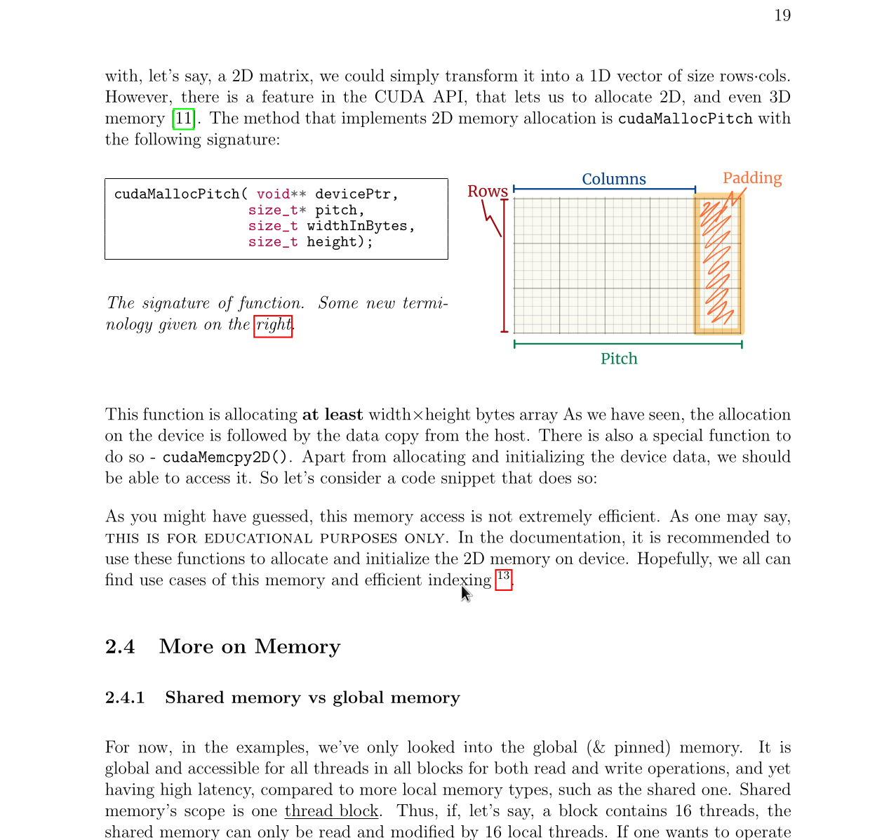

# Introduction to CUDA
## Personal notes

### Disclaimers 
- <strong> This is a pre-alpha version </strong>
- I did my best to put all the possible references. I need to, however, mention that <strong> everything </strong> was taken from books and online open sources. 
- I am not a computer science professional. I am not even a computer science student. Thus there may be some major or minor inaccuracies.

### Comments
I want to share with you my personal notes on this topic. 

At the moment, 
there are lot's of things to be completed and added, as initially, they were written for my personal use. 
I then decided, that adding some images and references would be the cause to share them publicly. 
The LaTeX document isn't __clean__ enough, regarding the references and paragraph intending. 

The author will do its best to add new chapters and section, as well as modify the new lacking features, meantioned above.
 and the source LaTeX code - `cuda_recap.tex`.

### ToDo's 
- [ ] Check spelling/grammar.
- [ ] Add parallel algorithm, other than reduce.

